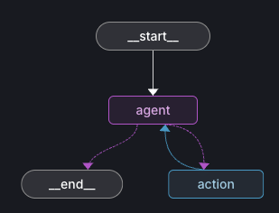
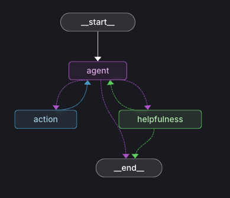

## <h1 align="center" id="heading">Session 14: Build & Serve Agentic Graphs with LangGraph</h1>

| 📰 Session Sheet | ⏺️ Recording     | 🖼️ Slides        | 👨‍💻 Repo         | 📝 Homework      | 📁 Feedback       |
|:-----------------|:-----------------|:-----------------|:-----------------|:-----------------|:-----------------|
| [Session 14: Deploying Agents to Production](https://www.notion.so/Session-14-Deploying-Agents-to-Production-26acd547af3d80a59047c1685ff6d61a) |[Recording!](https://us02web.zoom.us/rec/share/P6sJWRwsWWf2cF91MXOzrlM40Tay-CqoLp5drxoS6AGQEvMD3krhLzGFcrhyuAh3.HWnYPtpB0DL2mrj2) (cQ2$d7E5) | [Session 14 Slides](https://www.canva.com/design/DAG2pZbibmw/YJHR3HSgG992FE1I-Mmwjw/edit?utm_content=DAG2pZbibmw&utm_campaign=designshare&utm_medium=link2&utm_source=sharebutton) | You are here! | [Session 14 Assignment: LangGraph_Platform](https://github.com/AI-Maker-Space/AIE8/tree/main/14_LangGraph_Platform) | [AIE8 Feedback 10/23](https://forms.gle/rSCtaKTaPkTeqoo1A)

# Build 🏗️

Run the repository and complete the following:

- 🤝 Breakout Room Part #1 — Building and serving your LangGraph Agent Graph
  - Task 1: Getting Dependencies & Environment
    - Configure `.env` (OpenAI, Tavily, optional LangSmith)
  - Task 2: Serve the Graph Locally
    - `uv run langgraph dev` (API on http://localhost:2024)
  - Task 3: Call the API from a different terminal
    - `uv run test_served_graph.py` (sync SDK example)
  - Task 4: Explore assistants (from `langgraph.json`)
    - `agent` → `simple_agent` (tool-using agent)
    - `agent_helpful` → `agent_with_helpfulness` (separate helpfulness node)

- 🤝 Breakout Room Part #2 — Using LangGraph Studio to visualize the graph
  - Task 1: Open Studio while the server is running
    - https://smith.langchain.com/studio?baseUrl=http://localhost:2024
  - Task 2: Visualize & Stream
    - Start a run and observe node-by-node updates
  - Task 3: Compare Flows
    - Contrast `agent` vs `agent_helpful` (tool calls vs helpfulness decision)

## Activities and Questions 🏗️ &❓

#### ❓ Question 1:

Compare the `agent` and `agent_helpful` assistants defined in `langgraph.json`. Where does the helpfulness evaluator fit in the graph, and under what condition should execution route back to the agent vs. terminate?

##### ✅ Answer:

The agent assistant, which corresponds to the simple_agent graph_id, is a straightforward tool-using agent. It takes the user’s query, determines whether a tool is needed to answer it, and, if so, executes that tool before providing a response. If no tools are required, the conversation simply ends. This creates a simple linear flow—from the user’s input, through the agent’s reasoning, to an answer. If the answer requires additional information, the agent loops back to perform another tool action, repeating the process until it decides no further tools are needed. However, this approach does not evaluate the quality of its final answer, which means the output could still be incomplete, inaccurate, or lacking in context.

  
   
  <em>Simple Agent: Tool-calling loop</em>

The agent_helpful assistant, mapped to the agent_with_helpfulness graph_id, adds a new layer of reasoning through a helpfulness evaluator node. This evaluator is triggered after the agent produces a response but before the interaction ends. Its role is to assess whether the agent’s output is sufficiently helpful. If the evaluator determines the response meets the helpfulness threshold, the process terminates and returns the answer to the user. However, if the evaluator judges the response to be unhelpful, execution routes back to the main agent node, prompting a retry with an improved attempt. This creates a feedback loop that enables the agent to self-correct and refine its output. To avoid infinite retries, a loop limit is applied. In short, while the simple_agent completes its task in a single pass, the agent_helpful introduces self-evaluation and retry logic, making it more reflective and quality-driven. Overall, this mechanism serves as a built-in quality assurance layer—ensuring that answers are more relevant, thoughtful, and useful, even if occasional errors remain.

  
   
  <em>Agent with Helpfulness: Additional evaluation node</em>

#### 🏗️ Activity #1 Debugging A Graph

Select the `agent_with_helpfulness` and set one or more interrupts (at least one `Before` and one `After`). Try changing values and continuing the turn. 

#### ❓ Question 2:

What are your thoughts on when you would use a Before interrupt vs. an After interrupt?

##### ✅ Answer:

Interrupts are extremely helpful for understanding what’s happening at each step of a LangGraph execution, especially as systems grow in complexity. They allow you to observe and confirm what occurs before and after each node runs, giving you control and visibility into the flow. This makes it easier to identify issues, validate logic, and make targeted adjustments during development and debugging.

A Before interrupt is triggered right before a node in the graph executes. It pauses the flow to let you inspect or modify the node’s inputs—such as messages, state, or parameters—before they are processed. This type of interrupt is useful when you want to understand why the agent is making a certain decision, change its input conditions, or debug unexpected behavior before it happens. Essentially, it acts as a pre-execution checkpoint, allowing you to intervene at just the right moment to influence the node’s behavior. For example, when I asked the question “What was the government shutdown?”, I set a Before interrupt to observe which action the agent was about to take and which tool it planned to use before generating a response. This provided valuable insight into how the agent was reasoning about the task.

An After interrupt, by contrast, is triggered immediately after a node finishes executing. This gives you the opportunity to review what just happened—you can examine the outputs, observe how the state has changed, or verify that the result matches your expectations. It’s especially useful for debugging the results of tool calls, validating agent behavior, or logging outputs for later analysis. In this sense, it functions as a post-execution review that allows me to check reasoning. For instance, I set an after interrupt when asking, “How do you train for a marathon?” to pause right before the output was passed to the helpfulness node. This allowed me to inspect the agent’s initial reply and determine whether it was helpful or needed improvement.

🚧 Advanced Build 🚧 (OPTIONAL - <i>open this section for the requirements</i>)

- Create and deploy a locally hosted MCP server with FastMCP.
- Extend your tools in `tools.py` to allow your LangGraph to consume the MCP Server.

# Ship 🚢

- Running local server (`langgraph dev`)
- Short demo showing both assistants responding

# Share 🚀
- Walk through your graph in Studio
- Share 3 lessons learned and 3 lessons not learned

# Main Homework Assignment

Follow these steps to prepare and submit your homework assignment:
1. Create a branch of your `AIE8` repo to track your changes. Example command: `git checkout -b s14-assignment`
2. Complete the Tasks listed in the Breakout Room sections of `Build 🏗️`
3. Complete the activities and questions in `Activities and Questions 🏗️ &❓` by editing the file and replacing "_(enter answer here)_" with your responses
3. Commit, and push your completed notebook to your `origin` repository. _NOTE: Do not merge it into your main branch._
4. Record a Loom video reviewing the content of your completed notebook
5. Make sure to include all of the following on your Homework Submission Form:
    + The GitHub URL to the `README.md` file _on your assignment branch (not main)_
    + The URL to your Loom Video
    + Your Three Lessons Learned/Not Yet Learned
    + The URLs to any social media posts (LinkedIn, X, Discord, etc.) ⬅️ _easy Extra Credit points!_

### OPTIONAL: 🚧 Advanced Build Assignment 🚧

  
(<i>Open this section for the submission instructions.</i>)

Follow these steps to prepare and submit your homework assignment:
1. Create a branch of your `AIE8` repo to track your changes. Example command: `git checkout -b s14-assignment`
2. Create your MCP server
3. Add it to the existing graph's tools
4. Deploy it ***locally***
5. Validate the graph uses the MCP server's tools
6. Commit, and push your changes to your `origin` repository. _NOTE: Do not merge it into your main branch._
7. Record a Loom video reviewing the content of your completed notebook.
8. Make sure to include all of the following on your Homework Submission Form:
    + The GitHub URL to the notebook you created for the Advanced Build Assignment _on your assignment branch_
    + The URL to your Loom Video
    + Your Three Lessons Learned/Not Yet Learned
    + The URLs to any social media posts (LinkedIn, X, Discord, etc.) ⬅️ _easy Extra Credit points!_

