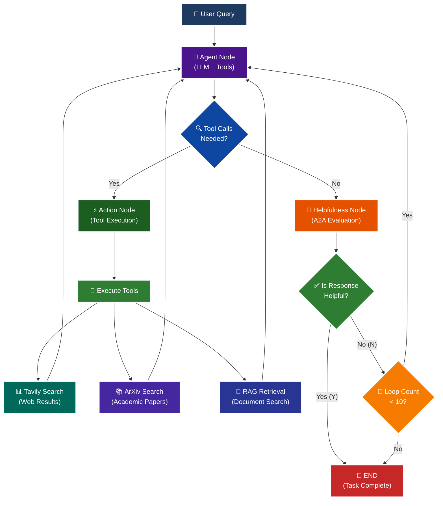

<p align = "center" draggable="false" >
</p>

## <h1 align="center" id="heading">Session 15: Build & Serve an A2A Endpoint for Our LangGraph Agent</h1>

| 📰 Session Sheet | ⏺️ Recording     | 🖼️ Slides        | 👨‍💻 Repo         | 📝 Homework      | 📁 Feedback       |
|:-----------------|:-----------------|:-----------------|:-----------------|:-----------------|:-----------------|
| [Session 15: Agent2Agent Protocol & Agent Ops](https://www.notion.so/Session-15-Agent2Agent-Protocol-Agent-Ops-26acd547af3d807c9fcdcc8864a6608a) |[Recording!](https://us02web.zoom.us/rec/share/Iz9bYK2w3p4FrtspRgMW4JKKxAlBVy1lKA-Xi99MzL7sqiLyHHVyAmyAq203HlqI.FvkopZBYLuYyCCu0) (Lyk+4@LS) | [Session 15 Slides](https://www.canva.com/design/DAG3HTQCrYs/Q2Oil7xFzz4DFEgmXdSGgg/edit?utm_content=DAG3HTQCrYs&utm_campaign=designshare&utm_medium=link2&utm_source=sharebutton) | You are here! | [Session 15 Assignment: A2A](https://forms.gle/fKTXjMJZHLReENUW9) | [AIE8 Feedback 9/16](https://forms.gle/LhGHKygFT3bfLqfS9)

# A2A Protocol Implementation with LangGraph

This session focuses on implementing the **A2A (Agent-to-Agent) Protocol** using LangGraph, featuring intelligent helpfulness evaluation and multi-turn conversation capabilities.

## 🎯 Learning Objectives

By the end of this session, you'll understand:

- **🔄 A2A Protocol**: How agents communicate and evaluate response quality

## 🧠 A2A Protocol with Helpfulness Loop

The core learning focus is this intelligent evaluation cycle:



# Build 🏗️

Complete the following tasks to understand A2A protocol implementation:

## 🚀 Quick Start

```bash
# Setup and run
./quickstart.sh
```

```bash
# Start A2A LangGraph server (Terminal 1)
uv run python -m app
```

```bash
# Test the A2A Server (Terminal 2 - Optional)
uv run python app/test_client.py
```

```bash
# OR: Run the Simple Agent Build Web UI (Terminal 2 - Activity #1)
uv run python simple_agent_build/app.py
# Then open http://localhost:8000 in your browser
```

### 🏗️ Activity #1:

Build a LangGraph Graph to "use" your application.

Do this by creating a Simple Agent that can make API calls to the 🤖Agent Node above through the A2A protocol.

**✅ Implementation:** See `simple_agent_build/` directory for a FastAPI web app with:
- LangGraph agent (single node) that calls the A2A agent
- Beautiful browser UI with streaming responses
- Real-time updates as responses arrive

**To run:**
```bash
# Terminal 1: Start A2A server
uv run python -m app

# Terminal 2: Start Simple Agent Build UI
uv run python simple_agent_build/app.py
# Open http://localhost:8000 in browser
```

See **[simple_agent_build/README.md](./simple_agent_build/README.md)** for details. 

### ❓ Question #1:

What are the core components of an `AgentCard`?

##### ✅ Answer:


An AgentCard defines the agent’s identification, abilities, and how other agents or clients can interact with it through the A2A (Agent-to-Agent) protocol. There are severl core compoents of an AgentCard, including: 

- name 
- description (what it is and what it does)
- hosted endpoints (URL) for access 
- version
- input and output modes (what kinds of data can be used and extracted)
- capabilities section (listing what the agent supports)
- skill section (tools that agent can use)
 
 Together, these elements make the AgentCard a complete description of an agent’s functionality and interoperability, allowing other agents or systems to automatically discover, understand, and communicate with it. In this folder, the AgentCard is defined in the main.py script, where it is initialized with the agent’s name, description, capabilities, and list of skills before being passed into the A2A server application.


<br />

### ❓ Question #2:

Why is A2A (and other such protocols) important in your own words?

##### ✅ Answer:

The A2A protocol is important because it gives agents a way to talk to each other in different ways (from sharing, asking for help or requests, evaltuoationsof each other's work, etc.) Instead of each agent working alone, A2A makes it possible to build connected multi-agent systems where agents can collaborate, specialize, and form intelligent feedback loops. It’s what turns a single model into part of a larger, cooperative AI network. This differs from MCP, which concentrates more on giving tools and services to Agents than being the plumbing for A2A. 


<br /><br />

<details>
<summary>🚧 Advanced Build 🚧 (OPTIONAL - <i>open this section for the requirements</i>)</summary>

Use a different Agent Framework to **test** your application.

Do this by creating a Simple Agent that acts as different personas with different goals and have that Agent use your Agent through A2A. 

Example:

"You are an expert in Machine Learning, and you want to learn about what makes Kimi K2 so incredible. You are not satisfied with surface level answers, and you wish to have sources you can read to verify information."
</details>

## 📁 Implementation Details

For detailed technical documentation, file structure, and implementation guides, see:

**➡️ [app/README.md](./app/README.md)** - A2A Research Agent implementation

This contains:
- Complete file structure breakdown
- Technical implementation details
- Tool configuration guides
- Troubleshooting instructions
- Advanced customization options

**➡️ [simple_agent_build/README.md](./simple_agent_build/README.md)** - Simple Agent Build (Activity #1)

This contains:
- LangGraph agent that uses A2A protocol
- FastAPI web UI implementation
- Streaming response handling
- Quick start guide

# Ship 🚢

- Short demo showing running Client

# Share 🚀

- Explain the A2A protocol implementation
- Share 3 lessons learned about agent evaluation
- Discuss 3 lessons not learned (areas for improvement)

# Submitting Your Homework

## Main Homework Assignment

Follow these steps to prepare and submit your homework assignment:
1. Create a branch of your `AIE8` repo to track your changes. Example command: `git checkout -b s15-assignment`
2. Complete the activity above
3. Answer the questions above _in-line in this README.md file_
4. Record a Loom video reviewing the Simple Agent you built for Activity #1 and the results.
5. Commit, and push your changes to your `origin` repository. _NOTE: Do not merge it into your main branch._
6. Make sure to include all of the following on your Homework Submission Form:
    + The GitHub URL to the `15_A2A_LANGGRAPH` folder _on your assignment branch (not main)_
    + The URL to your Loom Video
    + Your Three Lessons Learned/Not Yet Learned
    + The URLs to any social media posts (LinkedIn, X, Discord, etc.) ⬅️ _easy Extra Credit points!_

### OPTIONAL: 🚧 Advanced Build Assignment 🚧
<details>
  <summary>(<i>Open this section for the submission instructions.</i>)</summary>

Follow these steps to prepare and submit your homework assignment:
1. Create a branch of your `AIE8` repo to track your changes. Example command: `git checkout -b s015-assignment`
2. Complete the requirements for the Advanced Build
3. Record a Loom video reviewing the agent you built and demostrating in action
4. Commit, and push your changes to your `origin` repository. _NOTE: Do not merge it into your main branch._
5. Make sure to include all of the following on your Homework Submission Form:
    + The GitHub URL to the `15_A2A_LANGGRAPH` folder _on your assignment branch (not main)_
    + The URL to your Loom Video
    + Your Three Lessons Learned/Not Yet Learned
    + The URLs to any social media posts (LinkedIn, X, Discord, etc.) ⬅️ _easy Extra Credit points!_
</details>
